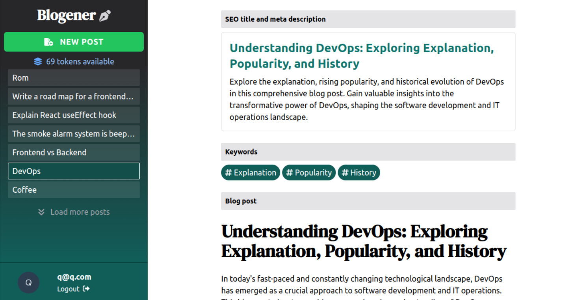
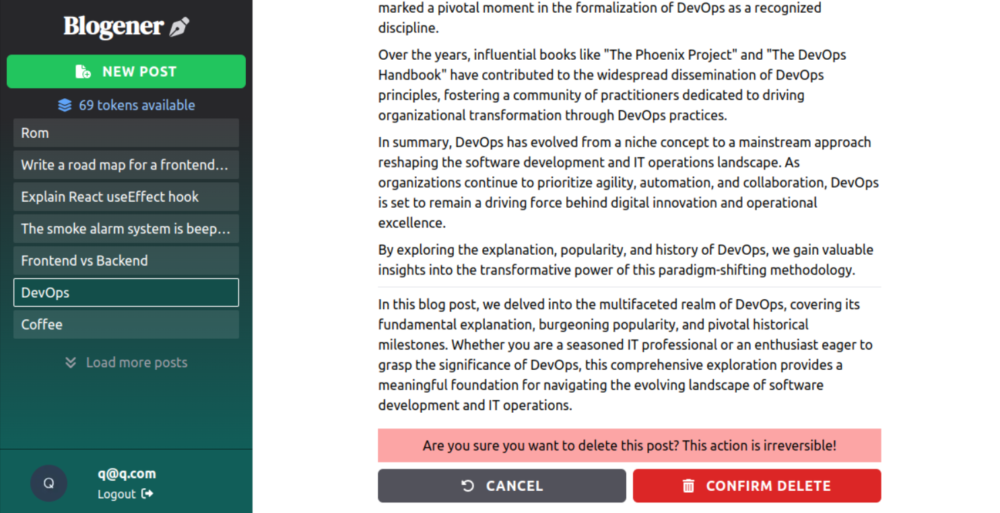
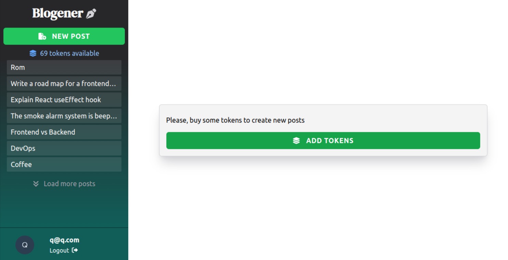
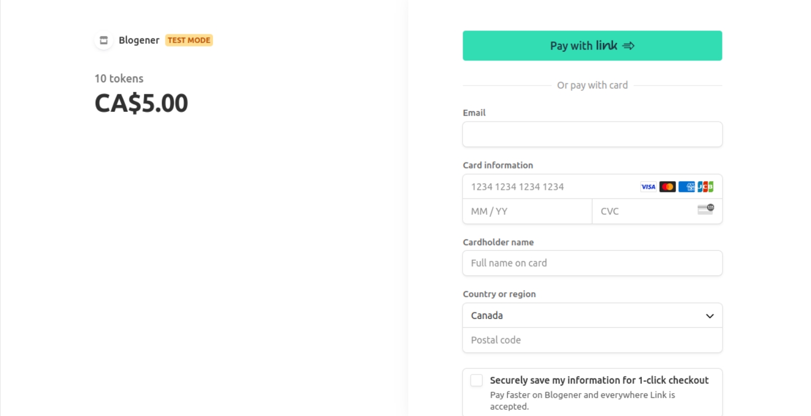

# Blogener

The AI-powered SAAS solution to generate SEO-optimized blog posts in minutes. Get high-quality content, without sacrificing your time.

This app was deployed on `DigitalOcean`: https://hammerhead-app-p5fmi.ondigitalocean.app/

Try it for free with the test credentials: login - `q@q.com`, password - `lowUPP09*&`

## Features of App

- A new user visiting the start page is directed to the signup/login page. The application employs [Auth0](https://auth0.com/) for robust and customizable user authentication. This safeguards your content and empowers you to efficiently manage user access.
- The application features a consistent dashboard comprising the following elements:
  - Button to generate a new post
  - Token balance display
  - List of generated posts
  - Current user information
  - Logout option
- To create a new post, users must input a topic and several relevant keywords. The application leverages the [OpenAI API](https://openai.com/) to create top-tier content on specified topics. It proposes captivating titles and supplies concise descriptions using provided keywords.
- Generated posts are divided into three sections: SEO title and meta description, Keywords, and the actual blog post. The content generator guarantees that the created content is finely tuned for search engine rankings. It aids in integrating relevant keywords and adheres to SEO best practices, thereby enhancing the discoverability of the content.
- Users can browse through the list of posts, read them, and delete them as desired. The application securely stores and administers the produced content within a dependable [MongoDB](https://www.mongodb.com/) database, guaranteeing swift retrieval and systematic organization for future reference.
- Tokens are utilized to generate new posts. To replenish their token balance users must procure tokens via the incorporated [Stripe](https://stripe.com/en-ca) payment system. This facilitates monetization of the application and furnishes users with a seamless payment experience.

## Tech Stack

NEXT JS | Tailwind CSS | MongoDB | OpenAI | Auth0 | Stripe | FontAwesome

## Demo

## Pages

##### Start Page

##### Generate new post

##### Explore generated blog

##### Delete post

##### Add tokens page

##### Stripe Payment

## Setup

To run the application locally, follow next steps:

- Clone the repository: `git clone <repository-url>`
- Install dependencies: `npm install`
- Adjust the configuration file with the required API keys:
  - Initialize a database in `MongoDB`, and obtain connection details.
  - Acquire an API key from `OpenAI`.
  - Create `Stripe` account and acquire the necessary API keys.
  - Set up the essential authentication parameters in `Auth0`.
- Start the development server: `npm run dev`
- Enjoy the application: http://localhost:3000
